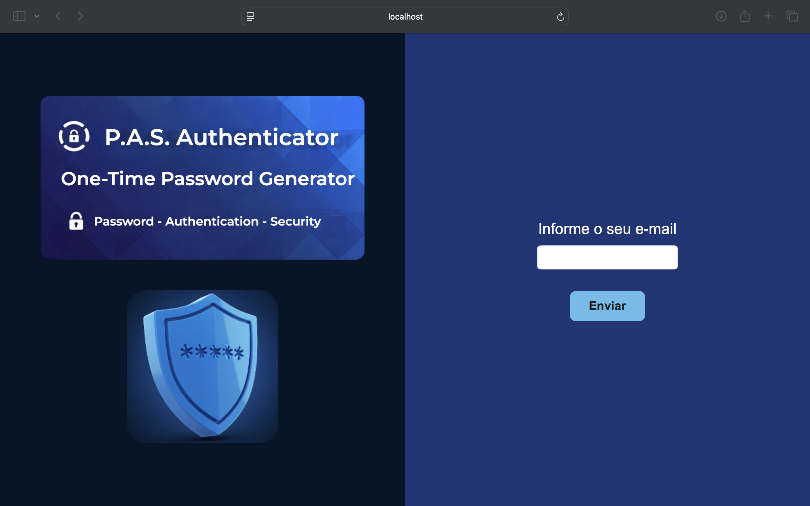
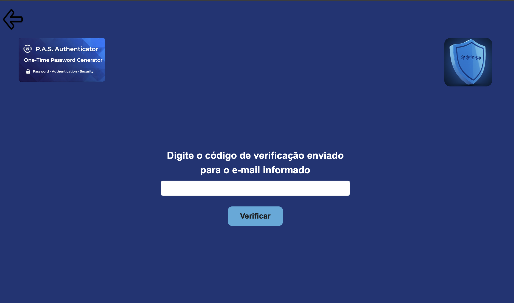

# 🔐 P.A.S. Authenticator (OTP Generator)


> **Projeto Acadêmico:** Desenvolvido como parte do curso **Técnico em Desenvolvimento de Sistemas do Senac-RS**.

## 💻 Sobre o Projeto

O **P.A.S. Authenticator** é um sistema web focado em segurança da informação que implementa um gerador de **One-Time Passwords (OTP)**.

O projeto simula fluxos de autenticação moderna, como **Passwordless Login** (login sem senha) e **Autenticação Multifator (MFA)**, demonstrando na prática como proteger sistemas contra vulnerabilidades de credenciais estáticas.

### 🌟 Funcionalidades Principais
* **Geração de OTP:** Criação de códigos únicos usando algoritmos seguros (`SecureRandom`).
* **Validação Temporal:** O código expira automaticamente após um tempo determinado (TTL).
* **Simulação de Envio:** Integração preparada para disparo de tokens via e-mail.
* **Segurança:** Bloqueio temporário após múltiplas tentativas falhas (proteção contra *Brute-Force*).
* **Interface Web:** Front-end responsivo para teste do fluxo de usuário.

## 📸 Screenshots

<div align="center">
  
  
</div>

## 🛠 Tecnologias Utilizadas

* **Back-end:** Java com Spring Boot (API REST)
* **Banco de Dados:** MySQL (JPA/Hibernate)
* **Front-end:** HTML5, CSS3, JavaScript (Thymeleaf)
* **Ferramentas:** Maven, Git, Mailtrap (para testes de e-mail)

## 🚀 Como Executar Localmente

### Pré-requisitos
* Java 17 instalado
* MySQL rodando na porta 3306
* Maven

### Passo a passo

1. **Clone o repositório**
   ```bash
   git clone [https://github.com/gracianedev/P.A.S.Authenticator.git](https://github.com/gracianedev/P.A.S.Authenticator.git)
   ```

2. **Configure o Banco de Dados**
    * Crie um banco de dados no seu MySQL chamado `pas_authenticator`.
    * Na raiz do projeto, crie um arquivo chamado `.env` (baseado no `.env.example`) com suas credenciais:
      ```properties
      SPRING_DATASOURCE_URL=jdbc:mysql://localhost:3306/pas_authenticator
      SPRING_DATASOURCE_USERNAME=seu_usuario
      SPRING_DATASOURCE_PASSWORD=sua_senha
      MAIL_USERNAME=seu_usuario_mailtrap
      MAIL_PASSWORD=sua_senha_mailtrap
      ```
    <details>
   <summary> Clique aqui para ver como configurar o Mailtrap (Grátis)</></summary>

    1. Crie uma conta gratuita no [Mailtrap.io](https://mailtrap.io).
    2. No painel, vá em **Email Testing** > **Inboxes**.
    3. Clique em "My Inbox" e em "Show Credentials".
    4. Copie o **Username** e **Password**.
    5. Cole no seu arquivo `.env`:
       ```properties
       MAIL_USERNAME=coloque_o_username_aqui
       MAIL_PASSWORD=coloque_o_password_aqui
       ```
   </details>

3. **Popule o Banco de Dados (Usuário de Teste)**
   * Como o banco inicia vazio, execute o comando SQL abaixo no seu banco de dados para criar um usuário inicial (utilize o e-mail criado no Mailtrap):
   ```bash
    INSERT INTO user (email, nome) VALUES ('test@email.com', 'Usuário Teste');
   ```

4. **Execute a aplicação**
   ```bash
   ./mvnw spring-boot:run
   ```

5. **Acesse**
    * Abra o navegador em: `http://localhost:8080`
    * Login: utilize o e-mail cadastrado para testar.

## 📚 Documentação

A documentação completa do projeto, incluindo diagramas, requisitos e relatórios de teste, está disponível na pasta [`/docs`](./docs) deste repositório.

## 👩‍💻 Autora

[**Graciane**](mailto:graciane.dev@gmail.com)
*****
